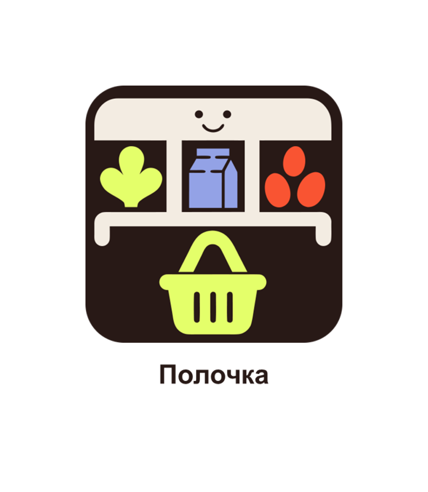
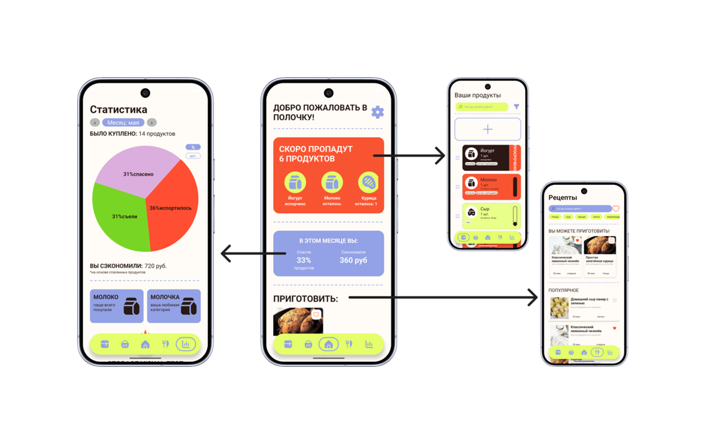
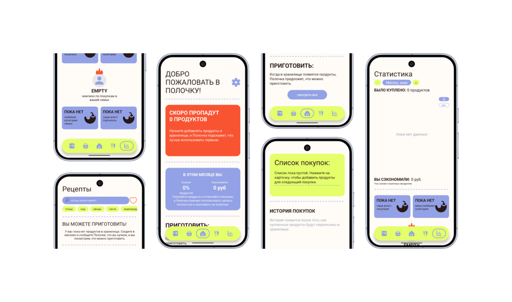
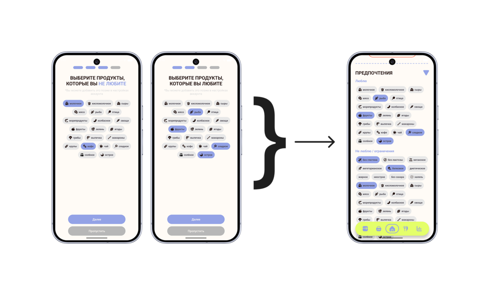
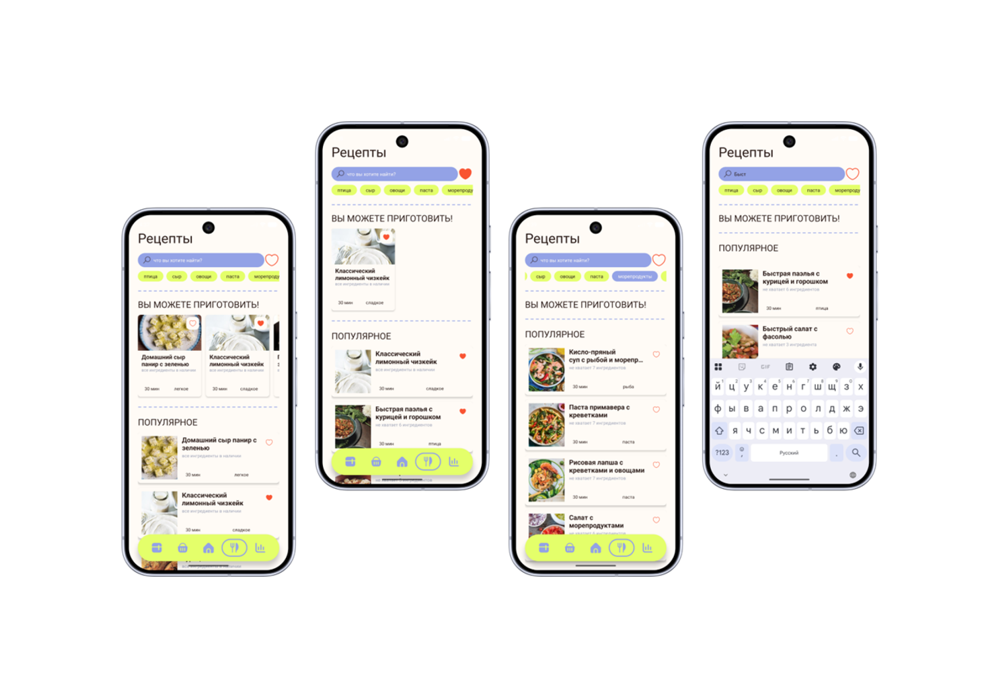
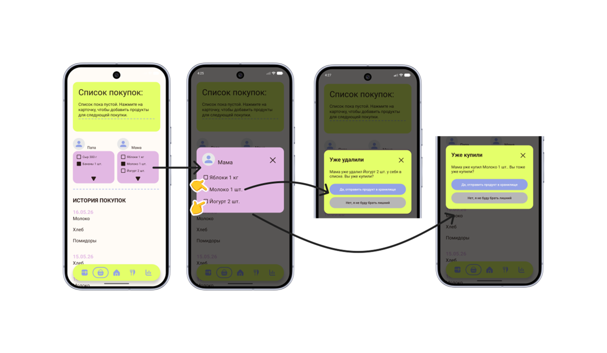
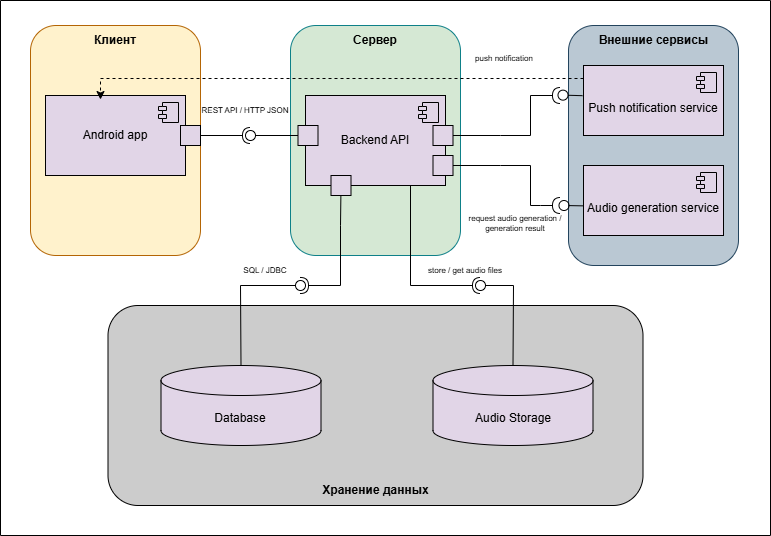

# Polochka

> Smart Family Food Storage Management System

---

---

# About

**Polochka** is a full-stack Android application created to simplify home food storage management.

The application allows users to keep track of products, monitor expiration dates, organize shopping lists, browse recipes and efficiently manage family food supplies from a single mobile application.

Unlike a typical academic assignment, Polochka was designed as a complete software engineering project, covering the entire development lifecycle—from requirements analysis and UX design to backend implementation, database architecture and mobile development.

---

# Project Overview

- 📱 Native Android application
- ⚙️ REST API backend
- 🗄 PostgreSQL database
- 🎨 Complete UI/UX prototype
- 📚 Software engineering documentation
- 🧪 Testing documentation
- 📐 UML diagrams
- 🏛 Presented at a scientific conference
- 🏆 Awarded **III Place**

---

# Backend Repository

The backend is developed as an independent service.

➡️ **https://github.com/KKseniaK/polochka-backend**

---

# Conference

Polochka was presented at the **XIII All-Russian Scientific and Practical Conference _"Science and Education in Ensuring the Sustainable Development of Human Potential"_ (Perm State Humanitarian Pedagogical University, 2026)** as a collaborative software engineering and UI/UX project.

The project was developed together with **[Natasha Kazakova](https://www.behance.net/d0dcd17e)**, who was responsible for the UI/UX design and the complete interactive Figma prototype. 

The project was awarded **3rd Place**, recognizing both the technical implementation and the overall product concept.

🏆 **[Award Diploma](https://disk.yandex.ru/i/cXWxrLvMu0R7KQ)**

---

# Main Screens

The application is organized around several key modules that provide quick access to everyday functionality.

From the main screen users can navigate to:

- 🥫 Product Storage
- 🍳 Recipes
- 🛒 Shopping Lists
- 👤 User Profile
- ⚙️ Settings

The navigation structure was designed to minimize the number of actions required to reach the desired functionality.

---

# Empty States

Special attention was paid to user experience even when no data is available.

Designed empty states include:

- Empty storage
- Empty shopping list
- No saved recipes
- Search without results
- First application launch

Instead of displaying blank pages, every state provides contextual illustrations and helpful guidance for the user.

---

# Authentication

The authentication flow focuses on simplicity and intuitive interaction.

Includes:

- Welcome screen
- Login
- Registration
- Input validation
- Authorization flow

---

# Recipe Module

The recipe system allows users to discover meals using ingredients already available at home.

Features include:

- Recipe catalog
- Detailed recipe pages
- Ingredients
- Cooking steps
- Search
- Filtering

Future versions will include recommendation algorithms and voice-assisted cooking.

---

# Conflict & Error States

A separate set of interfaces was designed to gracefully handle exceptional situations.

Examples include:

- No Internet connection
- Server unavailable
- Authorization errors
- Validation errors
- Product conflicts
- Unexpected application failures

Each screen clearly communicates the problem and suggests possible recovery actions.

---

# System Architecture

The project follows a layered client-server architecture that separates presentation, business logic and data access into independent components.

### Architecture Overview

The system consists of three primary layers:

### 📱 Android Client

Responsible for the user interface and interaction logic.

- MVVM architecture
- Repository Pattern
- ViewModels
- UI State Management
- DTO mapping
- REST communication

---

### ⚙️ Backend

Implements the application business logic and API layer.

- Kotlin
- Ktor
- REST API
- Authentication
- Validation
- Business services

---

### 🗄 Database

Persistent storage designed with scalability and normalization in mind.

Includes entities such as:

- Users
- Products
- Categories
- Recipes
- Ingredients
- Recipe Steps
- Tags
- Shopping Lists
- Measurement Units

---

## Tech Stack

# Roadmap

Planned features include:

- Voice assistant
- Barcode scanner
- Push notifications
- AI-powered recipe recommendations
- Docker deployment
- Cloud synchronization
